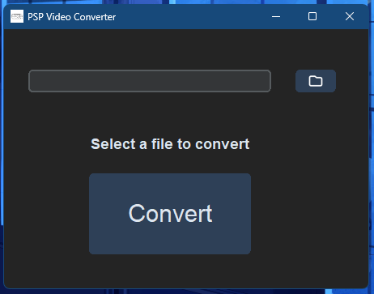

<h1 align="center">PSP Video Converter</h1>
<p align="center">A simple program that converts videos to the PSP</p>

<div align="center">
 
</div>

<h2>Preview</h2>

<div align="center">
  
</div>

## Purpose

The purpose of this program is to help the PSP community convert videos to the PlayStation Portable in a simple, fast, and efficient way. There are websites that perform this same process, but the waiting time for the file to be converted is longer compared to using the program from this repository, and the final file using the program is about 20% smaller in size compared to videos converted using other methods.

## How to use

#### Download the .exe file

You can download the .exe file clicking [here](https://github.com/LonelyALpHaz/PSP-video-converter/releases)

or...

#### Cloning the repository

Clone the repository to have local access to all the necessary files. You can do this using the following command:

```
git clone https://github.com/LonelyALpHaz/PSP-video-converter.git
```

#### Converting the video

```Note:``` You can use videos in .mp4, .mkv, and .avi formats (formats tested during the development of the project; other formats not listed may be compatible, but I have no knowledge of them).

1. Click the button with the folder icon and select the file you want to convert;
2. Click the "Convert" button and wait until the message 'Conversion done!' appears on the program's screen.

The converted file will have the same title as the original file with '_psp' added at the end; you can rename it as you wish.

## Disclaimer

If you encounter any errors, don't hesitate to open an issue. Suggestions, critiques, and tips on how the project can be improved are welcome!
