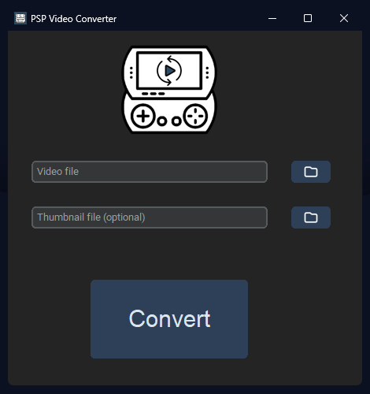
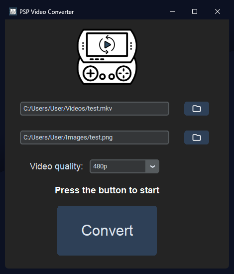

<h1 align="center">PSP Video Converter</h1>
<p align="center">A simple program that converts videos for the PSP</p>

<div align="center">
 
</div>

## Purpose

The purpose of this program is to help the PSP community convert videos to the PlayStation Portable in a simple, fast, and efficient way. There are websites that perform this same process, but the waiting time for file conversion is longer compared to using the program from this repository, and the final file size using the program is about 20% smaller compared to videos converted using other methods.

## Preview

<div align="center">
  
</div>


## How to use

#### Download the .exe file

You can download the .exe file clicking [here](https://github.com/LonelyALpHaz/PSP-video-converter/releases).

or...

#### Cloning the repository

Clone the repository to have local access to all the necessary files. You can do this using the following command:

```
git clone https://github.com/LonelyALpHaz/PSP-video-converter.git
```

> [!IMPORTANT]
Due to the Github's file upload limit, it was not possible to include the [FFmpeg](https://www.ffmpeg.org/) files. If you choose to clone the repository, please download the latest version and place the "ffmpeg" folder containing the "ffmpeg.exe" file in the same directory as the other program folders.

#### Converting the video and thumbnail

> [!NOTE]
You can use videos in **.mp4**, **.mkv**, and **.avi** video formats and **.jpg** and **.png** image formats (formats tested during the development of the project; other formats not listed may be compatible, but I have no knowledge of them).
‎

‎
1. Click the first folder icon to select the video file;
2. **(Optional)** In the second folder icon, select the image file that will be used as the thumbnail;
3. Select video quality (```240p```: Smaller file size, but lower resolution; or ```480p```: Larger file size, but higher resolution).
4. Click the "Convert" button and wait until the message "Conversion done!" is displayed.
‎

#### Viewing the video on your PSP

4. Plug your PSP or SD card into your device;
5. In the root of your card, copy the converted video file and the thumbnail (if you chose to use one) to the VIDEO folder;
6. Safely remove your PSP or SD card from your device.

The thumbnail file and the converted video (which will have the same name as the original file with "_psp" added at the end) will be saved in the same folder. The thumbnail file in .THM format **must** have the exact same name as the video file for the thumbnail to be displayed on the PSP.

## Resources used 

Project developed in ```Python``` version 3.12 using ```FFmpeg``` for video manipulation, the ```CustomTkinter``` module for creating the graphical interface and the ```auto-py-to-exe``` to generate the executable file.

## Disclaimer

If you encounter any errors, don't hesitate to open an issue. Suggestions, critiques, and tips on how the project can be improved are welcome!
